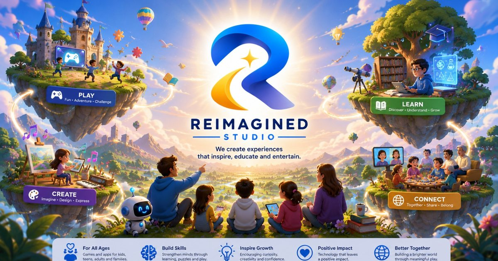

<div align="center">
  
  <h1>Reimagined Studio</h1>
  <p><strong>Play with purpose. Imagine what comes next.</strong></p>
  <p>
    <a href="https://awahab07.github.io/reimagined-studio/">Website</a> ·
    <a href="mailto:awo.edutainment+info@gmail.com">Contact</a>
  </p>
</div>

---

Reimagined Studio creates imaginative games and apps that entertain, educate,
inspire growth, and bring people together. This repository contains the studio
website, approved brand media, repeatable image-preparation tooling, and its
GitHub Pages deployment.

## Preview locally

The website has no build step:

```bash
python3 -m http.server 4173 --directory site
```

Open [http://localhost:4173](http://localhost:4173).

## Repository map

```text
.
├── .github/workflows/pages.yml  # GitHub Pages deployment
├── scripts/
│   ├── prepare_assets.py        # Brand, artwork, and Play Store generation
│   └── verify_site.py           # Deterministic publication checks
├── source-assets/
│   └── website-graphics/        # Normalized approved originals
└── site/                         # Complete public GitHub Pages artifact
```

The deployment uploads `site/` only. Source artwork, scripts, repository
documentation, IDE metadata, and task-local files are not included in the Pages
artifact.

## Regenerate media

Image generation uses [Pillow](https://python-pillow.org/):

```bash
python3 -m pip install Pillow==11.3.0
python3 scripts/prepare_assets.py
```

The script:

- extracts a transparent logo and favicon family from the approved logo JPEG;
- creates optimized large and 960-pixel artwork variants;
- crops the five product illustrations used by the interactive experience cards;
- creates an opaque 512 × 512 Google Play developer icon;
- creates an opaque 4096 × 2304 Google Play header below the 1 MB limit.

Generated browser media lives under `site/assets/`.

## Verify

```bash
python3 scripts/verify_site.py
```

Verification checks required files, internal links, project-relative paths,
semantic benefit and product content, source/public boundaries, image
dimensions, alpha behavior, Google Play size limits, and promotional copy
length.

## Publish

Pushes to `main` trigger `.github/workflows/pages.yml`. The workflow verifies
the site, configures GitHub Pages, uploads `site/`, and publishes to:

<https://awahab07.github.io/reimagined-studio/>

The first deployment requires the repository Pages source to be set to
**GitHub Actions**.

## Public brand files

- Transparent logo: `site/assets/brand/logo-transparent.png`
- Favicon: `site/assets/brand/favicon.ico`
- Google Play developer icon: `site/assets/play-store/developer-icon.png`
- Google Play header: `site/assets/play-store/header-image.jpg`

For brand or studio enquiries, email
[awo.edutainment+info@gmail.com](mailto:awo.edutainment+info@gmail.com).

© Reimagined Studio. Brand identity and artwork may not be repackaged or
represented as another product.
